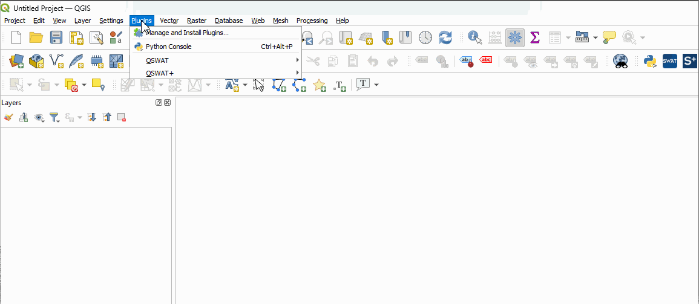

<h1 align="center">
   
  
   
  MapSWAT
   
</h1>

<h4 align="center">MapSWAT is a QGIS plugin for generating ready-to-use SWAT or SWAT+ input maps.</h4>

  <a href="#why-mapswat">Why MapSWAT?</a> •
  <a href="#installation">Installation</a> •
  <a href="#key-points">Key Points</a> •
  <a href="#how-to-use">How To Use</a> •
  <a href="#future-developments">Future Developments</a> •
  <a href="#credits">Credits</a> •
  <a href="#contact">Contact</a> •
  <a href="#support">Support</a>

## Why MapSWAT?

* **MapSWAT** optimizes the process of obtaining and preparing the input maps for both QGIS versions of SWAT **(Soil and Water Assessment Tool)**, **QSWAT** and **QSWAT+**. As you know, the SWAT model required: a digital elevation map (DEM), a land use map (LANDUSE) and a soil map (SOIL). **Obtaining and pre-processing these SWAT input maps can be a laborious and time-consuming task**. With the **new version of MapSWAT**, the necessary **SWAT input maps can be obtained and formatted in less than one minute for any part of the world, substantially reducing the time spent to pre-process them, as well as  excluding possible formatting errors**. The MapSWAT plugin can be a useful tool for beginners or advanced SWAT users who wish to quickly and accurately obtain and prepare the SWAT input maps. This allows them to focus on other more important parts of the hydrological modelling, such as calibration and validation.

> In case you are not yet fully convinced to use it. Below is an example of MapSWAT's potential.

## Installation

### Download

* You can download [**here**](https://github.com/AdrLBallesteros/MapSWAT/releases) the latest installable version of MapSWAT for Windows.

### Initial Setup

*	Before installing the MapSWAT plugin, it is necessary to download and install [**QGIS 3.x**](https://www.qgis.org/en/site/index.html). It is recommended to use the long-term release version.
  
*	**MapSWAT needs to get access to Google Earth Engine (GEE)**. In order to use GEE, **registration is required** at [https://signup.earthengine.google.com](https://signup.earthengine.google.com). When you GEE acount is accepted, you will receive the following email:

*	Launch a **QGIS 3 project**, navigate to **Plugins > Manage and Install Plugins > All**, and then search for [**"Google Earth Engine"**](https://github.com/gee-community/qgis-earthengine-plugin) plugin.

* The **MapSWAT** can now be installed. Launch the downloaded [MapSWAT executable](https://github.com/AdrLBallesteros/MapSWAT/releases), reboot the QGIS program and then activate the MapSWAT plugin from QGIS repository (**Plugins > Manage and Install Plugins > Installed**).

*	After activating the **MapSWAT plugin** for the first time, you will see the following message. **Users must register with their Google Earth Engine (GEE) account**. If an error occurs during this step (**localhost:8085**), return to QGIS and launch the MapSWAT plugin from the QGIS toolbar. Check if the **MapSWAT GEE** version works.

> If you are unable to connect to MapSWAT GEE, try to register to GEE with a different email address.

## Key Points

* MapSWAT is a single-use program, which means that when the program is closed all generated files will be deleted from QGIS canvas. However, all files will be still available in the MapSWAT folder.
  
* MapSWAT will only create the selected input maps, so remember to tick the box for each input map to generate them.
  
* If a python error appears during the use of MapSWAT, it is recommended to reboot the QGIS program to fix it. If it continues, please  <a href="#contact">contact me</a>.

## How To Use

1.	Click on the MapSWAT button of the QGIS toolbar to open the MapSWAT plugin. You will be prompted to select the version of MapSWAT you want to use.

> **MapSWAT v3.0**: This is the Standard version of MapSWAT. Users can import their own raster maps and prepare them in SWAT or SWAT+ format.

> **MapSWAT GEE**: This is the Connected to [Google Earth Engine (GEE)](https://earthengine.google.com/) version of MapSWAT. Users must first sign up for a GEE account and install the GEE plugin from the QGIS repository.

2.  Before going to the selected MapSWAT version, users also have to indicate a path to save the MapSWAT folder.

3.  Both versions are structured in the same way.

   
4.  In the first part of the MapSWAT window, users can insert or select the raster layers such as, a **digital elevation map (DEM)**, a **land use map (LANDUSE)** and a **soil map (SOIL)**. Remember to tick the box of the SWAT input map you want to obtain.
   
> Before moving on to the next part, users can also introduce an outlet point coordinates to easily locate the study area in the map canvas. This will unlock additional options such as **BUFFER CLIP** or **AUTOBASIN CLIP**.

5.  When previous steps have been done, users have to click on **ADD LAYERS** or **GET MAPS** to activate the following part of the MapSWAT plugin.

> Additionally, a **MERGE DEMs** option has been included in the standard version of MapSWAT. To use it, user must click on the MERGE DEMs button, select the DEM layers (.tif) to merge and click on the OPEN button.

6.  **CLIPPING OPTIONS**: MapSWAT includes several options for clipping raster layers.
  * **MANUAL CLIP**: Allows users to manually draw an extraction mask (POLYGON).
  

> After drawing the extraction mask, right-click the mouse and a window for indicating the FID number will appear. Set any number, for example 1, and click the **OK button**.

  * **SHAPEFILE CLIP**: Allows users to select any shapefile as an extraction mask (POLYGON).
  

> If you are using a shapefile from your study area, make sure it has only one attribute.

  * **BUFFER CLIP**:  With this option, an extraction mask (POLYGON) is automatically created around the outlet point. To do so, users have to indicate the buffer distance in kilometers (10 Km by default).
  

 * **AUTOBASIN CLIP**:  This option is **only available in the GEE version**, a predefined basin is obtained from [HydroSHEDS Basins](https://www.hydrosheds.org/products/hydrobasins) to be used as an extraction mask (POLYGON).
  

7. **SWAT INPUT MAPS CRS**:  This is the last part of the MapSWAT window, in this step users have to indicate a target CRS to reproject all generated maps.

   
> The **target CRS needs to be a metric CRS**, for example UTM.

8.  Now, the created raster layers **(“DEM”, “LANDUSE” and “SOIL”)** can be found in the QGIS canvas.

> Additionally, for the LANDUSE and SOIL input maps a template of their **LOOKUP tables** is automatically created. 

9.  When closing, a warning window is displayed to remind users that the QGIS canvas will be cleared and all uploaded files will disappear.

  

## Future Developments
- [ ] More DEM, LULC, and SOIL databases.
- [ ] Global input maps require by GWFLOW.
- [ ] Extract climate data from GEE in SWAT/SWAT+ format.
- [ ] Upload to the QGIS plugin repository.

Contributions are what make the open source community such an amazing place to learn, inspire, and create. Any suggestions you make are greatly appreciated.

## Credits

This software uses the following open source packages:

* [**QGIS**](https://github.com/qgis/QGIS)
* [**qgis-earthengine-plugin**](https://github.com/gee-community/qgis-earthengine-plugin)

## Contact

If you have feedback or suggestions, please contact me at **alopez6@ucam.edu**.

## Support

If you find this plugin useful, or if it has saved you time in your work, consider supporting it by inviting me for a coffee. Thanks! 😊

